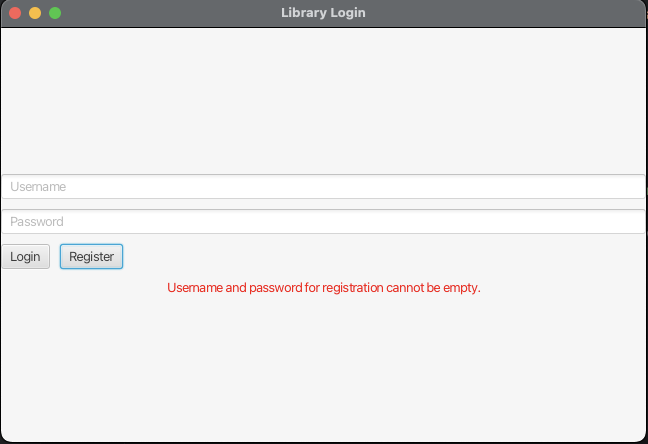
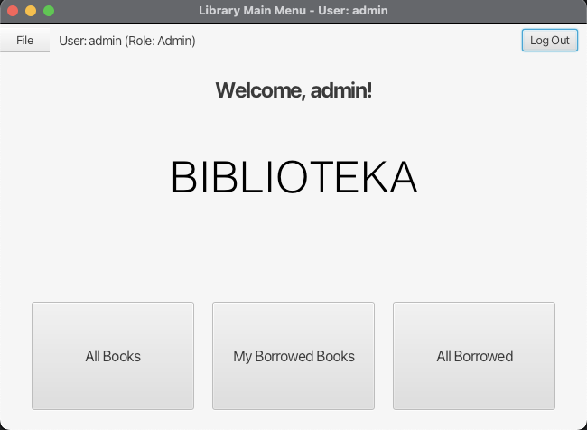
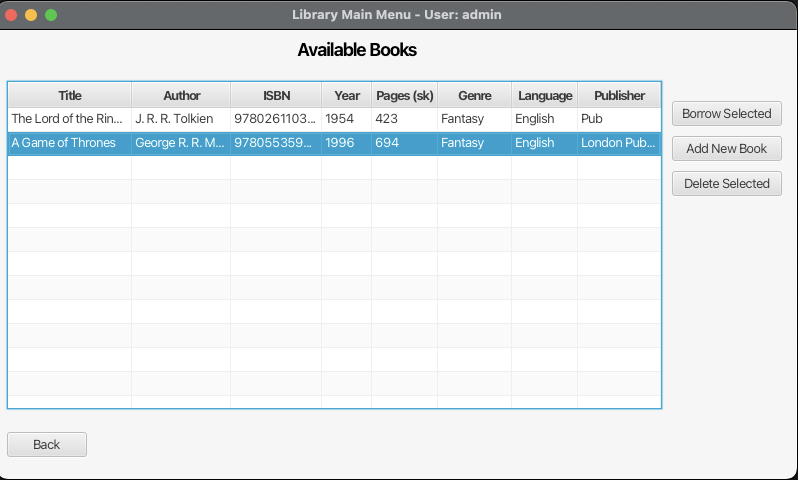
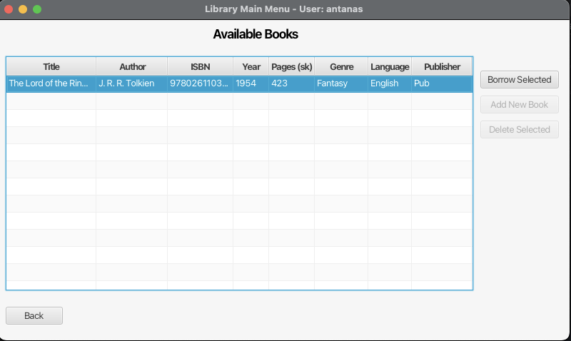
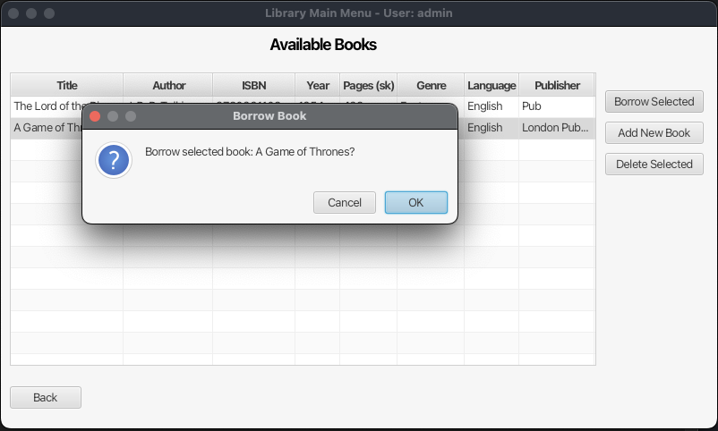
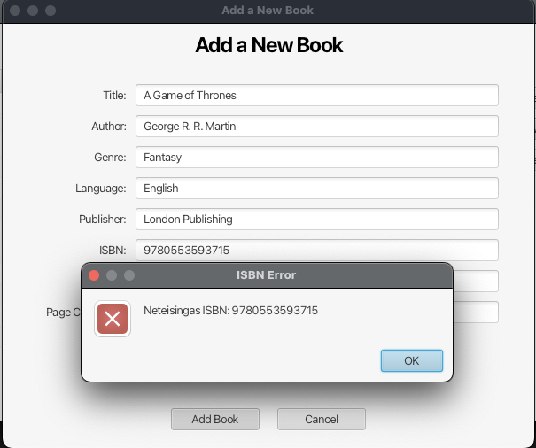
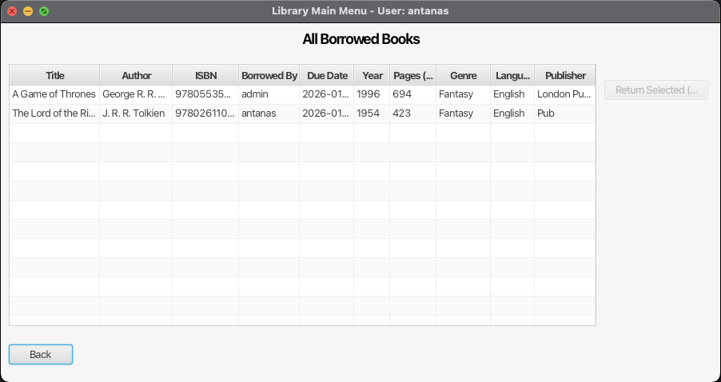
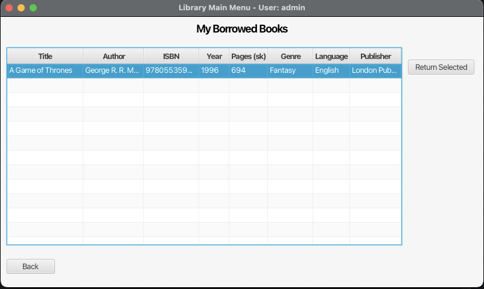

---

# Projektas "Biblioteka"

## Turinys
1.  [Paskirtis](#1-paskirtis)
2.  [Technologijos](#2-technologijos)
3.  [Diegimas ir paleidimas](#3-diegimas-ir-paleidimas)
4.  [Funkcionalumas](#4-funkcionalumas)
5.  [Grafinė vartotojo sąsaja](#5-grafinė-vartotojo-sąsaja)
6.  [Pagrindinės klasės ir struktūra](#6-pagrindinės-klasės-ir-struktūra)
7.  [Panaudoti projektavimo šablonai](#7-panaudoti-projektavimo-šablonai)
8.  [Plėtimo galimybės](#8-plėtimo-galimybės)
9. [Klasių diagramos paveikslėlis](#9-klasių-diagramos-paveikslėlis)

---

## 1. Paskirtis

Projektas "Biblioteka" yra programinė įranga, skirta mažos bibliotekos leidinių (knygų, elektroninių knygų, žurnalų) ir vartotojų administravimui. Sistema leidžia kataloguoti leidinius, valdyti jų skolinimo ir grąžinimo procesus.

---

## 2. Technologijos

-   **Programavimo kalba:** Java (versija 8 ar naujesnė, dėl `java.time` ir JavaFX naudojimo)
-   **Grafinė vartotojo sąsaja (GUI):** JavaFX
-   **Duomenų saugojimas:** Java serializacija (objektai saugomi dvejetainiu formatu `.dat` faile)
-   **Kolekcijos:** Java Collections Framework (`ArrayList`, `List`), JavaFX Observable Collections (`ObservableList`)
-   **Dokumentacija:** Javadoc

---

## 3. Diegimas ir paleidimas

### Reikalavimai
- Java 21 ar naujesnė versija
- Maven 3.6+ (arba naudokite projekte esančius `mvnw` / `mvnw.cmd`)

### Paleidimas

**Naudojant Maven Wrapper:**
```bash
# Windows
mvnw.cmd clean javafx:run

# Linux/Mac
./mvnw clean javafx:run
```

**Naudojant sistemos Maven:**
```bash
mvn clean javafx:run
```

### Numatytoji paskyra
Pirmą kartą paleidus programą, automatiškai sukuriama administratoriaus paskyra:
- **Vartotojo vardas:** `admin`
- **Slaptažodis:** `admin`

**⚠️ SVARBU:** Pakeiskite numatytojo administratoriaus slaptažodį produkcinėje aplinkoje!

### Javadoc generavimas
```bash
mvn javadoc:javadoc
```
Generuota dokumentacija bus prieinama `target/site/apidocs/` kataloge.

---

## 4. Funkcionalumas

**Vartotojų valdymas:**
*   Prisijungimas ir registracija.
*   Dvi rolės: Administratorius ir Skaitytojas.

**Administratoriaus funkcijos:**
*   Pridėti naujus leidinius (šiuo metu GUI palaiko tik `Knyga` pridėjimą).
*   Pašalinti knygas iš bibliotekos.
*   Peržiūrėti visus bibliotekoje esančius (laisvus) leidinius.
*   Peržiūrėti visus pasiskolintus leidinius.
*   Grąžinti bet kurį pasiskolintą leidinį.

**Skaitytojo funkcijos:**
*   Peržiūrėti visus bibliotekoje esančius (laisvus) leidinius.
*   Pasiskolinti laisvas fizines knygas
*   Peržiūrėti savo pasiskolintų leidinių sąrašą.
*   Grąžinti savo pasiskolintus leidinius.
*   Peržiūrėti visų pasiskolintų leidinių sąrašą (tik peržiūros režimu).

**Leidinių tipai:**
*   **Knyga (`Knyga`):** Fizinė knyga su ISBN, autoriumi, žanru ir kt. Gali būti skolinama. Yra `Cloneable` ir `Serializable`.
*   **ElektronineKnyga (`ElektronineKnyga`):** Skaitmeninė knyga, paveldinti iš `Knyga`. Turi failo formatą, dydį MB. Negali būti skolinama.
*   **Zurnalas (`Zurnalas`):** Fizinis žurnalas su ISSN, numeriu, tema ir kt.

**Duomenų validacija:**
*   ISBN ir ISSN numerių tikrinimas.
*   Bazinė kitų laukų validacija (pvz., metai, puslapių skaičius).

---

## 5. Grafinė vartotojo sąsaja

Programa turi šiuos pagrindinius langus:

### 1. Prisijungimo langas (Login View)
- Vartotojo vardo ir slaptažodžio įvedimas
- Prisijungimo ir registracijos mygtukai
- Klaidos pranešimų rodymas



### 2. Pagrindinis langas (Main View / Dashboard)
- Sveikinimo pranešimas su vartotojo informacija
- Trijų pagrindinių funkcijų mygtukai:
  - **"All Books"** - Visų knygų sąrašas
  - **"My Borrowed Books"** - Mano pasiskolintos knygos
  - **"All Borrowed"** - Visų pasiskolintų knygų sąrašas
- Meniu juosta su File meniu (Load State, Save State, Exit)
- Atsijungimo mygtukas



### 3. Visų knygų langas (All Books View)
- Visų bibliotekoje esančių knygų sąrašas (lentelė)
- Knygų informacija: pavadinimas, autorius, ISBN, žanras, metai, puslapių skaičius
- Administratoriui: knygų pašalinimo mygtukas
- Skaitytojui: knygų skolinimo mygtukas

**Administratoriaus vaizdas:**


**Skaitytojo vaizdas:**


**Skolinimo langas:**


### 4. Knygos pridėjimo langas (Add Book View)
- Forma naujai knygai pridėti (tik administratoriui)
- Laukai: pavadinimas, autorius, ISBN, žanras, metai, puslapių skaičius
- Validacijos pranešimai
- Išsaugojimo ir atšaukimo mygtukai


**Validacijos klaidos pranešimas:**


### 5. Visų pasiskolintų knygų langas (All Borrowed View)
- Visų pasiskolintų knygų sąrašas
- Informacija: knyga, skolininkas, skolinimo data
- Priversto grąžinimo mygtukas




### 6. Mano pasiskolintų knygų langas (My Borrowed Books View)
- Vartotojo pasiskolintų knygų sąrašas
- Informacija: knyga, skolinimo data
- Grąžinimo mygtukas



---

## 6. Pagrindinės klasės ir struktūra

**Paketai:**
*   **`biblioteka.core`**: Pagrindinės duomenų modelio klasės, sąsajos ir išimtys.
    *   Klasės: `Leidinys` (abstrakti), `Knyga`, `ElektronineKnyga`, `Zurnalas`, `User`.
    *   Sąsajos: `Borrowable`, `Postponable`, `Digital`, `Downloadable`.
    *   Išimtys: `BookException`, `InvalidISBNException`.
*   **`biblioteka.factory`**: Klasės, įgyvendinančios "Factory Method" šabloną leidinių kūrimui.
    *   `LeidinysFactory` (abstrakti), `KnygaCreator`, `ZurnalasCreator`.
*   **`biblioteka.gui`**: Klasės, susijusios su grafine vartotojo sąsaja.
    *   Pagrindinė aplikacijos klasė: `BookApplication`.
    *   Duomenų saugykla ir prieigos sluoksnis: `LibraryRepository`.
    *   Duomenų išsaugojimo/įkėlimo logika: `PersistenceManager`.
*   **`biblioteka.gui.controller`**: Valdiklių (Controller) klasės, skirtos FXML failams.
    *   `LoginController`, `MainViewController`, `BookController`, `AddBooksController`, `BorrowedController`, `MyBorrowedBooksController`.

---

## 7. Panaudoti projektavimo šablonai

*   **Factory Method:** Įgyvendinta per `biblioteka.factory` paketą (`LeidinysFactory`, `KnygaCreator`, `ZurnalasCreator`) leidinių objektų kūrimui.
*   **MVC (Model-View-Controller) / MVVM (Model-View-ViewModel):** Bendra GUI architektūra.
    *   **Modelis:** `biblioteka.core` klasės ir `LibraryRepository`.
    *   **Vaizdas:** FXML failai.
    *   **Valdiklis/ViewModel:** `biblioteka.gui.controller` klasės.

---

## 8. Plėtimo galimybės

*   Pilnai integruoti `Zurnalas` ir `ElektronineKnyga` pridėjimą ir valdymą per GUI.
*   Įdiegti paieškos ir filtravimo funkcionalumą leidiniams.
*   Saugesnis slaptažodžių saugojimas (pvz., naudojant bcrypt ar Argon2).
*   Pridėti galimybę redaguoti esamų leidinių informaciją per GUI.
*   Ataskaitų generavimas (pvz., populiariausios knygos, vėluojantys grąžinti).


---


## 9. Klasių diagrama


---